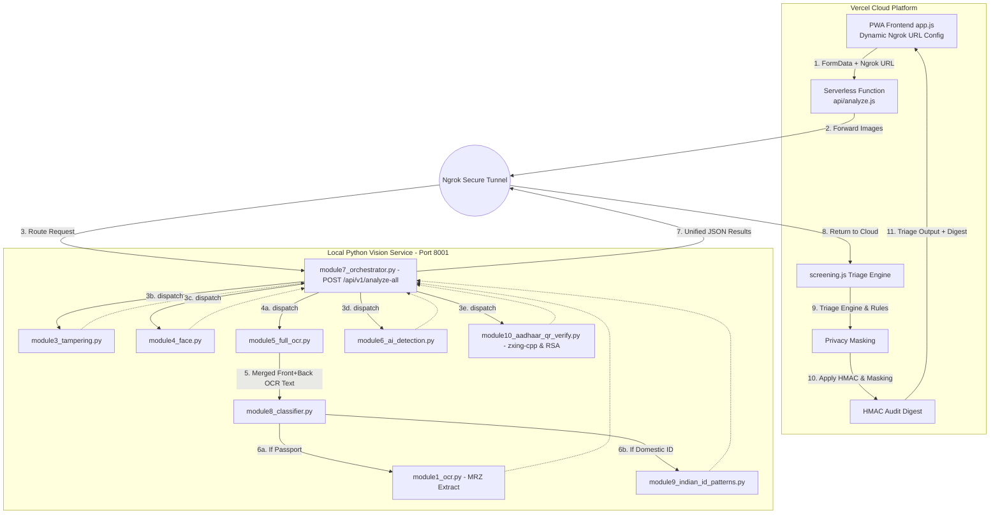
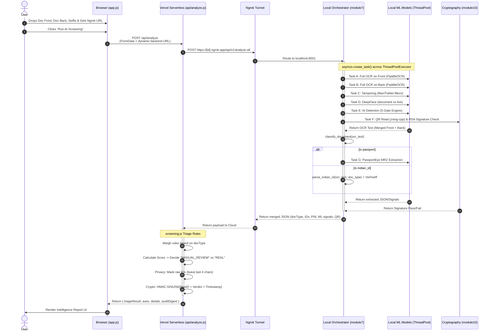

# Identity Document Detection - Architecture & Data Flow

This document details the complete end-to-end architecture of the **Document Integrity Demo**, which supports Global Passports as well as Indian domestic IDs (Aadhaar, PAN, Voter ID, Driving Licence). The system is strictly divided between a cloud-hosted Vercel frontend/gateway and a local Python-based machine learning inference engine exposed via Ngrok.

## 1. High-Level System Architecture



---

## 2. Detailed Data Flow Sequence

The following sequence diagram outlines the step-by-step data exchange during a screening event, demonstrating the concurrent execution model in Python.



---

## 3. The 5-Gate AI Detection Architecture

The `module6_ai_detection.py` subsystem specifically runs a multi-gate filter cascade on the document image to catch varying types of forgery and synthetically generated identities. This runs consistently regardless of the document type.

```mermaid
graph TD
    Image[Raw Bytes] --> Preprocess[Decode & Resize]
    
    Preprocess --> Gate1[Gate 1: EXIF Metadata Check]
    Preprocess --> Gate2[Gate 2: Screen/Moire Detection]
    Preprocess --> Gate3[Gate 3: Noise Analysis]
    Preprocess --> Gate4[Gate 4: Frequency/Edges]
    Preprocess --> Gate5[Gate 5: Synthetic Identity FFT <br/>Threshold: 250.0]
    
    Gate1 --> Agg[Aggregate Results]
    Gate2 --> Agg
    Gate3 --> Agg
    Gate4 --> Agg
    Gate5 -.-> |Weight 0.0 Info Only| Agg
    
    Agg --> Score[Calculate Total AI Risk Score]
    Score --> Output[{"is_ai_generated": bool, "confidence": float, "details": [...]}]
```

## 4. Privacy & Compliance Boundary

The architecture is explicitly designed to meet DPDP / GDPR / Aadhaar Act constraints regarding biometric handling:

1. **Memory-Only Processing**: Images are buffered in RAM during the Vercel `fetch` and locally via `FastAPI`. No images are ever saved to disk in the cloud or locally.
2. **Deterministic Triage Isolation**: The Vercel cloud environment never runs heavy ML processing; it strictly evaluates discrete output signals (e.g., `confidence: 0.82`, `signature_valid: True`) over a secure Ngrok tunnel.
3. **Data Minimization (Masking)**: Aadhaar, PAN, Voter ID, and Driving Licence numbers are immediately masked by the Vercel Serverless Function (e.g. `••••••••1234`). The raw ID is NEVER transmitted back to the browser or stored in plaintext.
4. **Cryptographic Auditing (HMAC)**: Instead of logging PII for auditing, the system generates a **deterministic HMAC-SHA256 digest** using a secure hash. This allows investigators to correlate repeat usages of a forged ID across multiple transactions without ever exposing the raw plaintext ID to an outside observer.
