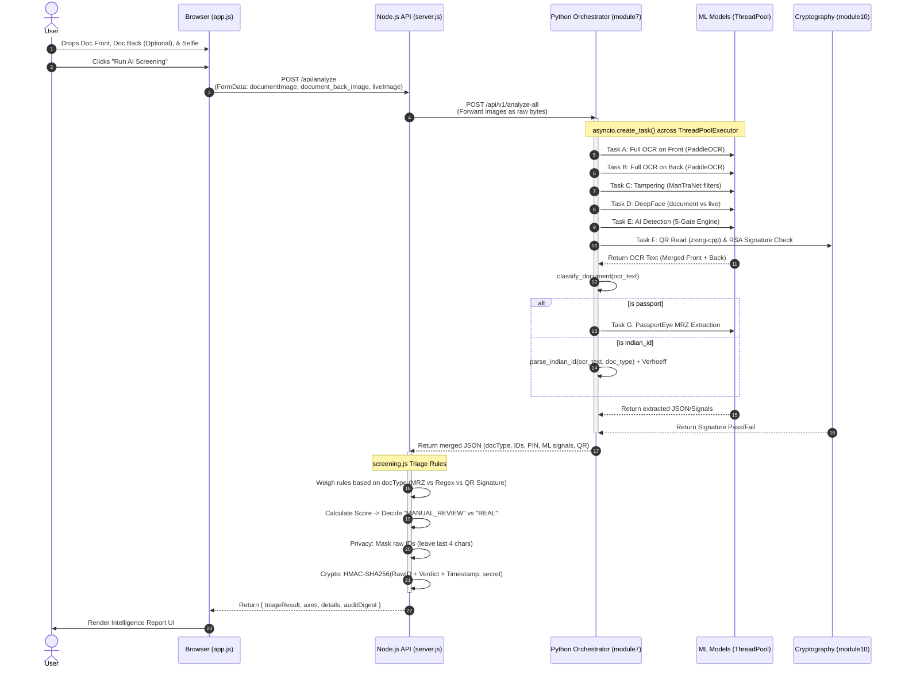

# Identity Document Detection - Architecture & Data Flow

This document details the complete end-to-end architecture of the **Document Integrity Demo**, which supports Global Passports as well as Indian domestic IDs (Aadhaar, PAN, Voter ID, Driving Licence). The system is strictly divided between a deterministic, privacy-aware Node.js gateway and a Python-based machine learning inference engine.

## 1. High-Level System Architecture

```mermaid
graph TD
    %% Frontend Layer
    subgraph Frontend [Browser Client / Frontend]
        UI[app.js UI & Dropzones<br/>Front, Back, Selfie]
        State[Form State & Pre-validation]
    end

    %% Gateway Layer
    subgraph Gateway [Node.js Gateway - Port 3000]
        API_Upload[POST /api/analyze]
        Triage[screening.js Triage Engine]
        Privacy[Privacy Masking]
        Digest[HMAC Audit Digest]
    end

    %% ML Vision Layer
    subgraph VisionService [Python Vision Service - Port 8001]
        Orchestrator[module7_orchestrator.py - POST /api/v1/analyze-all]
        
        Classifier[module8_classifier.py]
        OCR[module1_ocr.py - MRZ Extract]
        IndianIDs[module9_indian_id_patterns.py]
        
        Tamper[module3_tampering.py]
        Face[module4_face.py]
        FullOCR[module5_full_ocr.py]
        AIDetect[module6_ai_detection.py]
        QRVerify[module10_aadhaar_qr_verify.py - zxing-cpp & RSA]
    end

    %% Flow Connections
    UI -->|1. Multipart Form Data (Images)| API_Upload
    API_Upload -->|2. Forward Images| Orchestrator
    
    Orchestrator -->|3a. dispatch| FullOCR
    Orchestrator -->|3b. dispatch| Tamper
    Orchestrator -->|3c. dispatch| Face
    Orchestrator -->|3d. dispatch| AIDetect
    Orchestrator -->|3e. dispatch| QRVerify
    
    FullOCR -->|4. Merged Front+Back OCR Text| Classifier
    Classifier -->|5a. If Passport| OCR
    Classifier -->|5b. If Domestic ID| IndianIDs
    
    OCR -.-> Orchestrator
    IndianIDs -.-> Orchestrator
    Tamper -.-> Orchestrator
    Face -.-> Orchestrator
    AIDetect -.-> Orchestrator
    QRVerify -.-> Orchestrator
    
    Orchestrator -->|6. Unified JSON Results| Triage
    Triage -->|7. Triage Engine & Rules| Privacy
    Privacy -->|8. Apply HMAC & Masking| Digest
    Digest -->|9. Triage Output + Digest| UI
```

---

## 2. Detailed Data Flow Sequence

The following sequence diagram outlines the step-by-step data exchange during a screening event, demonstrating the concurrent execution model in Python.



---

## 3. The 5-Gate AI Detection Architecture

The `module6_ai_detection.py` subsystem specifically runs a multi-gate filter cascade on the document image to catch varying types of forgery and synthetically generated identities. This runs consistently regardless of the document type.

```mermaid
graph TD
    Image[Raw Bytes] --> Preprocess[Decode & Resize]
    
    Preprocess --> Gate1[Gate 1: EXIF Metadata Check]
    Preprocess --> Gate2[Gate 2: Screen/Moire Detection]
    Preprocess --> Gate3[Gate 3: Noise Analysis]
    Preprocess --> Gate4[Gate 4: Frequency/Edges]
    Preprocess --> Gate5[Gate 5: Synthetic Identity FFT <br/>Threshold: 250.0]
    
    Gate1 --> Agg[Aggregate Results]
    Gate2 --> Agg
    Gate3 --> Agg
    Gate4 --> Agg
    Gate5 -.-> |Weight 0.0 Info Only| Agg
    
    Agg --> Score[Calculate Total AI Risk Score]
    Score --> Output[{"is_ai_generated": bool, "confidence": float, "details": [...]}]
```

## 4. Privacy & Compliance Boundary

The architecture is explicitly designed to meet DPDP / GDPR / Aadhaar Act constraints regarding biometric handling:

1. **Memory-Only Processing**: Images are buffered in RAM during the Node.js `multer` upload and `httpx` forward. No images are ever saved to disk.
2. **Deterministic Triage Isolation**: The Node.js triage server never sees raw ML tensor data or image buffers during decision making—it strictly evaluates discrete output signals (e.g., `confidence: 0.82`, `signature_valid: True`).
3. **Data Minimization (Masking)**: Aadhaar, PAN, Voter ID, and Driving Licence numbers are immediately masked by the Node server (e.g. `••••••••1234`). The raw ID is NEVER transmitted back to the browser or stored in plaintext.
4. **Cryptographic Auditing (HMAC)**: Instead of logging PII for auditing, the system generates a **deterministic HMAC-SHA256 digest** using a secured environment secret. This allows investigators to correlate repeat usages of a forged ID across multiple transactions without ever exposing the raw plaintext ID to an outside observer.
